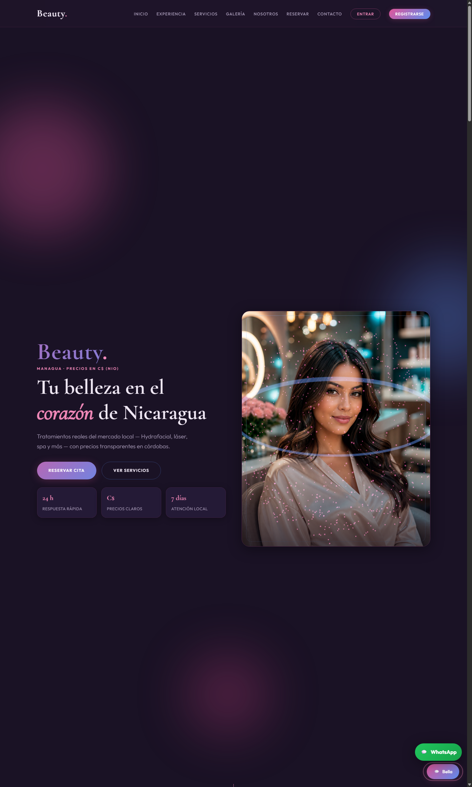

# Beauty Nicaragua

[](https://github.com/Tatiana-22MJ/beauty-nicaragua/actions/workflows/ci.yml)

🌐 **Demo en producción:** [https://web-production-6419f.up.railway.app](https://web-production-6419f.up.railway.app)



**Beauty** es una aplicación web de reservas para salón / spa en **Managua, Nicaragua**: agenda en tiempo real por duración de cada servicio, chat con Bella, anticipo con comprobante y panel administrativo. Corre con backend Flask (Docker) en **Railway** + **Supabase** (PostgreSQL 17 y Storage).

### Funciones principales

- **Reserva en línea** con agenda por duración del servicio y protección contra dobles reservas.
- **Chat con Bella** (solo usuarias registradas) y **recordatorios 24 h** por WhatsApp/email automáticos.
- **Anticipo por transferencia** con subida de comprobante, más QR y link de pago opcionales.
- **Reseñas** aprobadas por el admin, ficha e historial de clientas, export CSV de citas.
- **Panel administrativo**: citas, servicios, packs, reseñas, clientas y chats — con CI y backups diarios.

### Ejecutar en 4 pasos

```bash
git clone https://github.com/Tatiana-22MJ/beauty-nicaragua.git && cd beauty-nicaragua
py -m pip install -r requirements.txt
copy .env.example .env    # bash: cp .env.example .env
py app.py
```

Abrí [http://127.0.0.1:5000](http://127.0.0.1:5000). Sin `DATABASE_URL` usa **SQLite local**; con Supabase usa **PostgreSQL**. Tests, variables y deploy: [§4 Instalación](#4-instalación-y-ejecución).

---

## Índice

1. [Resumen ejecutivo](#1-resumen-ejecutivo)
2. [Stack tecnológico](#2-stack-tecnológico)
3. [Requisitos previos](#3-requisitos-previos)
4. [Instalación y ejecución](#4-instalación-y-ejecución)
5. [Arquitectura del sistema](#5-arquitectura-del-sistema)
6. [Estructura de carpetas](#6-estructura-de-carpetas)
7. [Moneda y geolocalización (NIO / Nicaragua)](#7-moneda-y-geolocalización-nio--nicaragua)
8. [Catálogo de servicios localizados](#8-catálogo-de-servicios-localizados)
9. [Autenticación y cuentas](#9-autenticación-y-cuentas)
10. [Chat en tiempo real (Bella)](#10-chat-en-tiempo-real-bella)
11. [Reservas](#11-reservas)
12. [UI: animaciones, scrolltelling y 3D](#12-ui-animaciones-scrolltelling-y-3d)
13. [Imágenes y assets](#13-imágenes-y-assets)
14. [Modelos de base de datos](#14-modelos-de-base-de-datos)
15. [Rutas HTTP](#15-rutas-http)
16. [Eventos WebSocket](#16-eventos-websocket)
17. [Validación cliente / servidor](#17-validación-cliente--servidor)
18. [Plantillas Jinja2 (secciones de la página)](#18-plantillas-jinja2-secciones-de-la-página)
19. [Frontend JS y CSS](#19-frontend-js-y-css)
20. [Configuración y variables de entorno](#20-configuración-y-variables-de-entorno)
21. [Flujo de datos completo](#21-flujo-de-datos-completo)
22. [Fuentes de investigación (mercado Nicaragua)](#22-fuentes-de-investigación-mercado-nicaragua)
23. [Solución de problemas](#23-solución-de-problemas)
24. [Roadmap sugerido](#24-roadmap-sugerido)

---

## 1. Resumen ejecutivo

| Aspecto | Detalle |
|--------|---------|
| Producto | Landing + reservas + chat de salón Beauty |
| Estado | ✅ **En producción** (octubre 2026) — CI verde (pytest + flake8) |
| Mercado | Nicaragua (Managua) |
| Moneda | Córdobas nicaragüenses (`NIO`, símbolo `C$`) |
| Backend | Flask 3 + SQLAlchemy + Flask-Login + Flask-SocketIO (Gunicorn `gthread`) |
| Frontend | HTML5 semántico, CSS custom, JS vanilla, Three.js, Socket.IO |
| BD | **Supabase PostgreSQL 17** (rol `beauty_app`, RLS; SQLite solo en local/tests) |
| Storage | **Supabase Storage** (bucket privado `payment-proofs`, URLs firmadas) |
| Migraciones | **Alembic** (baseline `9d90adb36db1`, única fuente de verdad del esquema) |
| Deploy | **Railway** (Docker, healthcheck `/healthz`) — [demo](https://web-production-6419f.up.railway.app) |
| CI/CD | GitHub Actions: pytest + flake8, recordatorios diarios y backups de BD |
| Chat | Solo usuarias **registradas / autenticadas** |
| Visual | Hero full-bleed, scrolltelling, partículas 3D, imágenes locales |

### Integraciones de esta versión (octubre 2026)

- ✅ **Agenda por duración** — slots y solapes según `duration_minutes` de servicios y packs (nada de tratar todo como 60 min).
- ✅ **Reseñas** — la clienta reseña sus citas completadas, el admin aprueba y se publican en la portada (SEO local).
- ✅ **Recordatorios WhatsApp 24 h** — Twilio + email de respaldo, cron diario 07:00 Managua (GitHub Actions), marca `reminder_sent_at` y evita duplicados.
- ✅ **Admin completo** — paginación de citas, **export CSV**, listado y ficha de clienta con historial, gestión de reseñas, packs con duración.
- ✅ **Supabase Fase 1** — Postgres + Storage con fallback local, rol dedicado `beauty_app` (mínimos privilegios) + RLS con policy por tabla.
- ✅ **Alembic** — migraciones formales (sin `create_all` en producción), seeds idempotentes con flag `is_seed`.
- ✅ **Observabilidad** — `/healthz` (DB check), Sentry opcional (`SENTRY_DSN`), logs JSON (`LOG_FORMAT=json`).
- ✅ **CI + backups** — tests en cada push; `pg_dump` diario → bucket privado `backups` + artifact de 14 días.
- ✅ **Link/QR de pago** — configurable por `.env` (`PAYMENT_LINK`, `PAYMENT_QR_URL`, teléfono y referencia); se muestra en Mi cuenta y en el email de reserva.
- 🔜 Pendiente de producto: SEO local, modelo de personal.

---

## 2. Stack tecnológico

### Backend
- **Flask** — framework web y enrutado.
- **Flask-SQLAlchemy** — ORM (Postgres en producción, SQLite en local/tests).
- **psycopg 3** — driver PostgreSQL (Supabase pooler, puerto 5432).
- **Alembic (Flask-Migrate)** — migraciones versionadas del esquema.
- **Flask-Login** — sesiones de usuario y `@login_required`.
- **Flask-SocketIO** — WebSockets para el chat en tiempo real.
- **Flask-Limiter** — rate limiting por IP/ruta.
- **Gunicorn** (`gthread`) — servidor de producción, puerto desde `gunicorn.conf.py`.
- **Supabase Storage** — comprobantes de pago en bucket privado con URLs firmadas.
- **Twilio** — WhatsApp para recordatorios de cita (con fallback a link `wa.me`).
- **Sentry** — tracking de errores en producción (opcional).
- **Werkzeug** — hash de contraseñas (`generate_password_hash` / `check_password_hash`).

### Frontend
- **Jinja2** — plantillas server-side.
- **CSS custom** — variables de diseño, animaciones cubic-bezier buttery.
- **IntersectionObserver** — reveals y scrolltelling.
- **Three.js (r128)** — escena 3D de partículas en el hero.
- **Socket.IO client** — canal bidireccional del chat.

---

## 3. Requisitos previos

- **Python 3.10+** (anotaciones `str | None` y sintaxis moderna).
- pip / entorno virtual recomendado.
- Navegador moderno con WebGL (para el 3D) y WebSockets.

---

## 4. Instalación y ejecución

```bash
# 1) Entrar a la carpeta del proyecto
cd beauty

# 2) (Opcional) Crear y activar entorno virtual
py -m venv .venv
.\.venv\Scripts\activate

# 3) Instalar dependencias
py -m pip install -r requirements.txt

# 4) Copiar las variables de entorno y completarlas
copy .env.example .env        # bash: cp .env.example .env

# 5) Arrancar el servidor (Flask + SocketIO)
py app.py
```

Abrí en el navegador: [http://127.0.0.1:5000](http://127.0.0.1:5000)

**Base de datos:**

- **Sin `DATABASE_URL`** (default): usa **SQLite local** en `instance/beauty.db` — ideal para desarrollo.
- **Con `DATABASE_URL`** apuntando al pooler de Supabase: usa **PostgreSQL**. El esquema lo crea **Alembic** automáticamente al arrancar (no hace falta correr nada a mano).

**Tests:**

```bash
py -m pip install -r requirements-dev.txt   # pytest + flake8 (dev/CI)
py -m pytest -q                             # suite completa
py -m flake8 --select=E9,F63,F7,F82 .       # lint (igual que el CI)
```

> **Importante:** no abras los HTML estáticos a mano. El chat y las rutas requieren el servidor Flask con SocketIO (`py app.py`).

---

## 5. Arquitectura del sistema

```
┌───────────────────┐   HTTP / Jinja    ┌─────────────────────────────────────┐
│    Navegador      │ ◄───────────────► │  Gunicorn (Flask) — Railway (Docker)│
│  HTML/CSS/JS      │                   │  Rutas · Login · SocketIO · /healthz│
│  Three.js         │   WebSocket       └──────────────┬──────────────────────┘
│  Socket.IO        │ ◄───────────────►                │
└───────────────────┘                    ┌─────────────┼──────────────┬──────────────┐
                                         ▼             ▼              ▼              ▼
                              ┌─────────────────┐ ┌───────────┐ ┌───────────┐ ┌──────────────┐
                              │ Supabase        │ │ Supabase  │ │ Twilio    │ │ GitHub       │
                              │ PostgreSQL 17   │ │ Storage   │ │ WhatsApp  │ │ Actions      │
                              │ (pooler 5432,   │ │ bucket    │ │ (recordo- │ │ CI · cron    │
                              │ rol beauty_app, │ │ payment-  │ │ ratorios) │ │ recordatorios│
                              │ RLS por tabla)  │ │ proofs    │ │           │ │ y backups    │
                              └─────────────────┘ └───────────┘ └───────────┘ └──────────────┘
```

1. El cliente pide `/` → Flask consulta `Service` + `Review` + `SalonInfo` → renderiza `index.html`.
2. Registro/login → Flask-Login guarda la sesión en cookie firmada.
3. Chat: el cliente emite `send_message` → el servidor valida auth → `chatbot.get_bot_response` → emite `bot_message`.
4. Reserva: POST `/reservar` → validadores → hueco libre según **duración** (`availability.py`) → inserta `Booking`.
5. El arranque (`bootstrap_schema()`) corre `alembic upgrade` + seeds; `/healthz` verifica la conexión a Postgres para el healthcheck de Railway.

---

## 6. Estructura de carpetas

```
beauty/
├── app.py                  # Factory Flask, bootstrap (Alembic + seeds), rutas base, SocketIO
├── config.py               # SECRET_KEY, BD, moneda NIO, pagos, Twilio, fail-fast prod
├── extensions.py           # db, socketio, login, csrf, limiter, migrate
├── models.py               # User, Service, ServicePackage, Booking, ChatMessage, Review,
│                           #   SalonInfo, AuditLog
├── availability.py         # Agenda por duración: slots, solapes, huecos libres
├── validators.py           # Validación server-side (nombres, fechas, archivos, ratings)
├── notifications.py        # Emails, comprobante PDF de reserva, WhatsApp, recordatorios
├── reminders.py            # Lógica de recordatorios 24 h (collect/send, evita duplicados)
├── timeutils.py            # Zona horaria America/Managua
├── chatbot.py              # Motor contextual de Bella (precios C$, Managua)
├── seeds.py                # Seeds idempotentes (catálogo base con flag is_seed)
├── supabase_storage.py     # Subida de comprobantes + URLs firmadas (fallback local)
├── routes_admin.py         # Blueprint /admin (citas, servicios, packs, clientas, CSV…)
├── routes_account.py       # Blueprint /mi-cuenta (citas, cancelar, comprobante, reseñas)
├── gunicorn.conf.py        # Bind 0.0.0.0:$PORT (Railway) — sin shell expansion
├── requirements.txt        # Dependencias de producción
├── requirements-dev.txt    # pytest + flake8 (dev/CI)
├── Dockerfile              # Imagen de producción (Railway)
├── Procfile                # web: gunicorn -c gunicorn.conf.py app:app
├── railway.json            # Builder Docker + healthcheck /healthz
├── docker-compose.yml      # Stack completo para desarrollo con Docker
├── .env.example            # Plantilla de variables (copia a .env)
├── README.md               # Esta documentación
├── DEPLOY.md               # Guía de deploy en Railway + secrets de GitHub
├── SUPABASE_SETUP.md       # Proyecto Supabase: roles, RLS, Storage, backups
│
├── migrations/             # Alembic (baseline 9d90adb36db1) — única fuente de verdad
├── supabase/               # schema.sql de referencia (DBA)
├── scripts/                # send_reminders.py, migrate_sqlite_to_supabase.py
├── tests/                  # Suite pytest (features, app, availability, validators)
├── docs/                   # Documentación histórica + capturas (docs/screenshots/)
├── .github/workflows/      # ci.yml · reminders.yml · backup.yml
│
├── instance/
│   └── beauty.db           # SQLite SOLO en local (sin DATABASE_URL)
│
├── templates/
│   ├── base.html           # Layout: fonts, CSS, Three.js, Socket.IO
│   ├── index.html          # Landing completa (hero→footer→chat)
│   ├── auth/  account/  admin/  legal/   # Login, área clienta, panel admin, términos
│
└── static/
    ├── css/style.css       # Tema + animaciones + admin + responsive
    ├── js/                 # main, chat, scene3d, slots, validation
    └── images/             # Hero, salón y 8 imágenes de servicios (locales)
```

---

## 7. Moneda y geolocalización (NIO / Nicaragua)

### Configuración (`config.py`)
- `CURRENCY_CODE = "NIO"`
- `CURRENCY_SYMBOL = "C$"`
- `COUNTRY_CODE = "NI"`
- `COUNTRY_NAME = "Nicaragua"`
- `DEFAULT_LOCALE = "es_NI"`
- `TIMEZONE = "America/Managua"`

### Presentación en UI
- Filtro Jinja `{{ price|nio }}` → `C$ 1,800`.
- Context processor inyecta `currency_symbol`, `currency_code`, `country_name` en todas las plantillas.
- Columna `Service.currency` guarda `"NIO"` por servicio.
- Teléfonos con prefijo **+505**; placeholders y validación adaptados.
- Dirección y horarios del salón en **Residencial Bolonia, Managua**.
- Schema.org `BeautySalon` con `addressCountry: "NI"` y `currenciesAccepted: "NIO"`.

### Semilla forzada
Al arrancar, `seed_database()` **actualiza** precios, textos e imágenes y **elimina** servicios obsoletos (p. ej. semillas antiguas en euros / Madrid).

---

## 8. Catálogo de servicios localizados

Tratamientos inspirados en la oferta real de clínicas y spas de Nicaragua (Medical Spa Nicaragua, clínicas estéticas en Bolonia, Soul Wellness & Spa, La Font, salones de manicura/pedicura de Managua). Precios **referenciales** en córdobas:

| Servicio | Precio desde (NIO) | Notas de mercado |
|----------|--------------------|------------------|
| Corte & Peinado | C$ 550 | Salones Managua ~C$450–800 |
| Coloración & Balayage | C$ 1,800 | Coloración premium |
| Manicura & Pedicura | C$ 650 | Manicura ~C$455; pedicura ~C$600+ |
| Hydrafacial & Faciales | C$ 1,200 | Medical spa / Hydrafacial |
| Depilación Láser | C$ 950 | Sesión por zona (clínicas estéticas) |
| Maquillaje Profesional | C$ 1,100 | Eventos / bodas / XV |
| Spa & Masajes | C$ 900 | Spa individual; paquetes ~C$2,100 |
| Tratamiento Capilar | C$ 1,400 | Fortalecimiento / caída |

> Los precios son orientativos para la plataforma demo. En producción se recomienda cotización tras valoración.

---

## 9. Autenticación y cuentas

### Registro (`/registro`)
Campos: nombre, usuario, email, teléfono (+505), contraseña, confirmación.  
Validación doble (JS + Python). Contraseña hasheada. Autologin tras crear cuenta.

### Login (`/login`)
Identificador = **email o username** + contraseña. Opción “Recordarme”.

### Logout (`/logout`)
Requiere `@login_required`. Limpia la sesión Flask-Login.

### Por qué el chat exige cuenta
1. Evita abuso anónimo del WebSocket.
2. Asocia `ChatMessage.user_id` al historial.
3. Experiencia personalizada (“¡Hola, María!”).

---

## 10. Chat en tiempo real (Bella)

### Reglas de acceso
- **Backend:** `connect` retorna `False` si `not current_user.is_authenticated` y emite `auth_required`.
- **Backend:** `send_message` vuelve a comprobar auth.
- **Frontend:** si `data-authenticated="false"`, no abre socket; muestra botones de login/registro.

### Inteligencia del bot (`chatbot.py`)
Intenciones detectadas por keywords + fuzzy matching (`difflib`):
- Saludos, horarios, dirección Managua, contacto +505.
- Precios en **C$ / NIO**.
- Catálogo de servicios.
- Contexto de clínicas del mercado nicaragüense.
- Reservas, registro, agradecimientos, despedidas.
- Ficha detallada si el mensaje menciona un servicio (o un typo cercano).

Las respuestas se persisten en `chat_messages` (sender `user` / `bot`).

---

## 11. Reservas

Formulario en `#reservar` → POST `/reservar`:

1. Valida nombre, email, teléfono, servicio/pack existente, fecha y hora.
2. **La disponibilidad depende de la duración**: `availability.py` calcula los huecos del día según `duration_minutes` del servicio o pack elegido y bloquea cualquier opción donde el servicio no quepa antes del cierre. Un servicio de 120 min no se puede agendar a las 17:00 si cierra a las 18:00, y no solapa con la cita siguiente.
3. Protección contra dobles reservas: índice único parcial `uq_bookings_active_slot` (si dos clientas pisan el mismo hueco, la segunda recibe un error amable).
4. Crea `Booking` (`status=pending`, anticipo sugerido = 30% del precio si se marcó) y envía el email de confirmación **sin PDF** (el comprobante de reserva se entrega cuando el admin confirma la cita).

### Anticipo y comprobante

- La clienta ve los datos de cuenta (banco, cuenta, beneficiario, teléfono, QR/link si están configurados) en **Mi cuenta → detalle de la cita**.
- Sube su comprobante de transferencia (PNG/JPG/WEBP/PDF) → se guarda en **Supabase Storage** (bucket privado con URLs firmadas) y el pago queda `pending_transfer`.
- El admin valida y marca `paid` desde el panel.

### Después de la cita

- Si `status=completed`, la clienta puede dejar una **reseña** (1–5 estrellas + comentario); el admin la aprueba y se publica en la portada.
- 24 h antes de la cita corre el **recordatorio automático** por WhatsApp (Twilio) con email de respaldo (`reminder_sent_at` evita duplicados).

Fecha mínima = hoy (seteada en `main.js`).

---

## 12. UI: animaciones, scrolltelling y 3D

### Buttery smooth
- Transiciones globales `cubic-bezier(0.22, 1, 0.36, 1)`.
- Reveals con `IntersectionObserver` (una sola vez).
- Hover con `transform` (composited, sin layout thrash).
- Respeto a `prefers-reduced-motion`.

### Scrolltelling (`#experiencia`)
1. Escenario **sticky** con imagen + caption.
2. Tres capítulos (`scrolltell-chapter`) de ~70vh.
3. Al entrar un capítulo al viewport (~55%), JS crossfadea imagen y texto (bienvenida → tratamiento → renovación).

### 3D interactivo (`scene3d.js`)
- Esfera de ~900 partículas + torus.
- Colores de marca (rosa / azul).
- Responde a `pointermove` / `touchmove`.
- Loop `requestAnimationFrame` a ~60 fps.
- Canvas con `mix-blend-mode: screen` sobre la foto hero.

---

## 13. Imágenes y assets

Todas las imágenes de servicios y hero son **archivos locales** en `static/images/` (no dependen de Unsplash).  
Si una URL fallara, `onerror` en las plantillas cae a `salon-interior.png` o `hero-beauty.png`.

---

## 14. Modelos de base de datos

| Modelo | Tabla | Rol |
|--------|-------|-----|
| `User` | `users` | Cuentas (hash password, phone +505, `is_admin`) |
| `Service` | `services` | Catálogo NIO + `duration_minutes`, `image_url`, `currency`, `quote_only` |
| `ServicePackage` | `service_packages` | Packs regalables con `duration_minutes`, `includes`, `price` |
| `Booking` | `bookings` | Cita: fechas/horas, `status`, `payment_status`, `payment_proof`, `deposit_amount`, `admin_notes`, `reminder_sent_at` |
| `ChatMessage` | `chat_messages` | Historial del chat (sender `user`/`bot`) |
| `Review` | `reviews` | Reseña 1–5 de una cita completada; solo se publica con `is_approved` |
| `SalonInfo` | `salon_info` | Key/value (dirección, horarios, textos) |
| `AuditLog` | `audit_logs` | Auditoría de acciones del admin |

El esquema lo gestiona **Alembic** (`migrations/`, baseline `9d90adb36db1`): al arrancar corre `alembic upgrade` de forma idempotente; los seeds (`seeds.py`) solo crean/actualizan filas con `is_seed=True` y nunca borran datos reales. No existe `migrate_schema()`.

---

## 15. Rutas HTTP

### Públicas / auth (`app.py`)

| Método | Ruta | Vista | Descripción |
|--------|------|-------|-------------|
| GET | `/` | `index` | Landing completa |
| GET | `/healthz` | `healthz` | Healthcheck JSON (verifica Postgres) — lo usa Railway |
| GET | `/api/slots?date=…&service=…` | `api_slots` | Huecos libres del día (según duración) |
| GET/POST | `/registro` | `register` | Alta de usuaria |
| GET/POST | `/login` | `login` | Inicio de sesión |
| GET | `/logout` | `logout` | Cierre de sesión |
| GET/POST | `/recuperar` | `forgot_password` | Solicitud de restablecimiento |
| GET/POST | `/restablecer/<token>` | `reset_password` | Nueva contraseña por token |
| POST | `/reservar` | `reservar` | Alta de booking |
| GET | `/privacidad` · `/terminos` | — | Legales |

### Área de clienta (`/mi-cuenta`, `routes_account.py`)

| Método | Ruta | Descripción |
|--------|------|-------------|
| GET | `/mi-cuenta/` | Dashboard: mis citas, stats, pago |
| GET | `/mi-cuenta/cita/<id>` | Detalle de la cita + subir comprobante |
| POST | `/mi-cuenta/cita/<id>/cancelar` | Cancelar cita |
| GET/POST | `/mi-cuenta/cita/<id>/reprogramar` | Reprogramar (valida hueco) |
| POST | `/mi-cuenta/cita/<id>/comprobante` | Subir comprobante de anticipo |
| POST | `/mi-cuenta/cita/<id>/resena` | Dejar reseña (solo citas completadas) |

### Panel admin (`/admin`, `routes_admin.py`)

| Método | Ruta | Descripción |
|--------|------|-------------|
| GET | `/admin/` | Dashboard con métricas y citas recientes |
| GET/POST | `/admin/citas` | Gestión de citas (estado, pago, notas) + paginación |
| GET | `/admin/citas/export.csv` | Export CSV |
| GET/POST | `/admin/servicios` · `/admin/packs` | CRUD de catálogo |
| GET/POST | `/admin/resenas` | Aprobar/ocultar reseñas |
| GET | `/admin/clientas` · `/admin/clienta/<id>` | Listado y ficha con historial |
| GET | `/admin/comprobante/<id>` | Ver comprobante (URL firmada) |
| GET | `/admin/chats` | Historial de conversaciones |

---

## 16. Eventos WebSocket

| Evento | Dirección | Descripción |
|--------|-----------|-------------|
| `connect` | cliente→server | Exige auth; `join_room(session_id)` |
| `connected` | server→cliente | Confirma sala + nombre |
| `auth_required` | server→cliente | Sin sesión o sesión expirada |
| `send_message` | cliente→server | `{ message: "..." }` |
| `bot_message` | server→cliente | Respuesta de Bella |
| `user_message` | server→cliente | Eco opcional |

---

## 17. Validación cliente / servidor

| Campo | Cliente (`validation.js`) | Servidor (`validators.py`) |
|-------|---------------------------|----------------------------|
| Nombre | min 2 | min 2 / max 120 |
| Email | regex | regex |
| Teléfono | 8–20 dígitos/símbolos | idem (+ tip +505) |
| Usuario | `[A-Za-z0-9_]{3,30}` | idem |
| Contraseña | ≥8, letras+números | idem + confirm |
| Fecha | no pasada | no vacía |
| Servicio | required | existe en BD |

---

## 18. Plantillas Jinja2 (secciones de la página)

### `base.html`
Layout HTML5 `lang="es-NI"`, meta SEO/OG, fonts, CSS, Socket.IO, Three.js, `main.js`, `scene3d.js`.

### `index.html` — secciones
1. **Header / Nav** — marca + enlaces + auth.
2. **Hero `#inicio`** — marca Beauty., claim Nicaragua/NIO, CTAs, foto + canvas 3D, scroll cue.
3. **Scrolltelling `#experiencia`** — 3 actos narrativos.
4. **Beneficios** — localización, expertos, premium, chat auth.
5. **Servicios `#servicios`** — grilla con precios `|nio` e imágenes locales.
6. **Galería `#galeria`** — mosaico de trabajos.
7. **Nosotros `#nosotros`** — historia Managua + stats.
8. **Testimonios** — voces localizadas (Bolonia, Las Colinas, Plaza Las Cumbres).
9. **Reservar `#reservar`** — formulario.
10. **CTA cuenta** — solo si no hay sesión.
11. **Footer `#contacto`** — dirección, +505, horarios.
12. **Chat widget** — Bella (gate auth).

### Auth
`login.html` / `register.html` — formularios centrados con el mismo sistema visual.

---

## 19. Frontend JS y CSS

| Archivo | Función |
|---------|---------|
| `main.js` | Nav scrolled, menú móvil, reveals, scrolltelling, date min, booking validation |
| `chat.js` | Gate auth, Socket.IO, typing indicator, escape XSS |
| `scene3d.js` | Three.js partículas + torus interactivo |
| `validation.js` | API `BeautyValidation` + auto-attach auth forms |
| `style.css` | Tokens, hero, scrolltell, servicios, chat, responsive, reduced-motion |

---

## 20. Configuración y variables de entorno

Variables principales (el listado completo está en `.env.example`):

| Variable | Default | Uso |
|----------|---------|-----|
| `SECRET_KEY` | `beauty-dev-key-…` | Firmar cookies (cambiar en prod) |
| `DATABASE_URL` | `sqlite:///…/instance/beauty.db` | URI SQLAlchemy (en prod: rol `beauty_app` de Supabase) |
| `SUPABASE_URL` / `SUPABASE_SECRET_KEY` | — | Storage de comprobantes |
| `MAIL_*`, `TWILIO_*` | — | Email + WhatsApp (recordatorios) |
| `BANK_NAME` / `BANK_ACCOUNT` / `BANK_HOLDER` | demo | Datos de la cuenta para el anticipo (se muestran en Mi cuenta) |
| `PAYMENT_PHONE` / `PAYMENT_REFERENCE` | — | Teléfono que recibe la transferencia y texto de referencia (opcionales) |
| `PAYMENT_LINK` | — | Botón «Pagar en línea» junto al comprobante |
| `PAYMENT_QR_URL` | — | Imagen del QR de pago (o archivo `static/img/qr-pago.png`) |
| `SENTRY_DSN` | — | Errores en prod (opcional) |
| `LOG_FORMAT` | `text` | `json` para logs estructurados en prod |
| `FLASK_ENV` | `development` | `production` activa fail-fast de secretos |
| `BEAUTY_SKIP_SCHEMA_INIT` | — | `1` = no correr migraciones ni seeds al arrancar |

Ejemplo PowerShell:

```powershell
$env:SECRET_KEY="tu-clave-segura"
py app.py
```

Despliegue (Railway + workflows de recordatorios/backups): ver [`DEPLOY.md`](DEPLOY.md).

---

## 21. Flujo de datos completo

### Primera visita
1. `create_app()` → `bootstrap_schema()` (Alembic `upgrade` + `seed_database()`).
2. GET `/` → servicios NIO + info Managua + reseñas aprobadas → HTML.

### Registro → Chat
1. POST `/registro` → User + login.
2. Abre Bella → `io()` → `connect` OK → `connected`.
3. Escribe “precios” → `send_message` → Bella lista precios en C$ → `bot_message`.

### Reserva
1. Completa formulario → validación JS.
2. POST `/reservar` → validación Python → `Booking` → flash.

---

## 22. Fuentes de investigación (mercado Nicaragua)

La oferta y los rangos de precio se contrastaron con información pública de:
- Medical Spa Nicaragua (Hydrafacial, depilación láser, faciales, masajes).
- Clínica estética Dra. Indira Herrera (Bolonia, Managua — faciales, corporales, capilares, láser, spa médico).
- Soul Wellness & Spa (Plaza Las Cumbres — masajes, bienestar).
- Clínica La Font (láser / estética médico-quirúrgica).
- Salones de manicura/pedicura Managua (rangos ~C$455–1,200; pedicuras clínicas ~C$600–1,000).
- Referencias de spa/paquetes en el país (~C$2,100 paquetes combinados).

Beauty **no afirma afiliación** con esas marcas; las usa como referencia de mercado para localizar el catálogo demo.

---

## 23. Solución de problemas

| Síntoma | Causa probable | Solución |
|---------|----------------|----------|
| Chat no responde | No hay sesión | Registrate / iniciá sesión |
| `auth_required` | Cookie expirada | Volvé a loguearte |
| Precios viejos **en local** | SQLite desactualizada | Borrá `instance/beauty.db` y reiniciá `py app.py` (⚠️ solo aplica en local; en producción el esquema lo maneja Alembic, no borres nada) |
| `healthz` en 500 / `database: error` en Railway | `DATABASE_URL` mal o credenciales viejas | Verificá la variable en Railway (rol `beauty_app` del pooler, puerto 5432) y los logs de arranque; si cambiaste de proyecto Supabase, actualizá también `SUPABASE_URL`/`SUPABASE_SECRET_KEY` |
| Deploy fallido con healthcheck | La app no levantó | Mirá los logs de Railway: si dice `${PORT}` o bind, revisá que **Settings → Custom Start Command** esté vacío (manda `Procfile`/`Dockerfile`); si es error de migración, revisá `alembic upgrade` en los logs |
| `Fallo subiendo comprobante` | Storage sin configurar | La app cae a disco local (`UPLOAD_FOLDER`); configurá `SUPABASE_URL` + `SUPABASE_SECRET_KEY` para usar Storage |
| Imágenes rotas | Ruta incorrecta | Verificá `static/images/services/*.png` |
| Sin 3D | WebGL / Three no cargó | Revisá consola; usá Chrome/Edge actualizado |
| Puerto ocupado | Otro proceso en 5000 | Cambiá el puerto en `socketio.run(...)` o con `$env:PORT=5001` |

---

## 24. Roadmap sugerido

- ✅ Panel admin para editar precios NIO sin tocar código (incluye duración y packs).
- ✅ Recordatorios automáticos WhatsApp 24 h antes (Twilio + email, cron diario).
- ✅ Alembic para migraciones formales (baseline + stamp en Supabase).
- ✅ Tests automatizados (pytest + flake8) + CI en GitHub Actions.
- ✅ Deploy en Railway (Docker + healthcheck `/healthz`), backups diarios de la BD.
- ✅ Link/QR de pago configurable por `.env` (junto al flujo de transferencia con comprobante).
- 🔜 SEO local (Google Business Profile, sitemap, OG images).
- 🔜 Modelo de personal (varias estilistas) cuando se valide la demanda.

---

## Documentación adicional

| Documento | Contenido |
|-----------|-----------|
| [`DEPLOY.md`](DEPLOY.md) | Guía paso a paso de deploy en Railway + secrets de GitHub |
| [`SUPABASE_SETUP.md`](SUPABASE_SETUP.md) | Proyecto Supabase: pooler, rol `beauty_app`, RLS, Storage, backups |
| [`TESTING_GUIDE.md`](TESTING_GUIDE.md) | Manual de pruebas manuales del flujo completo |
| [`docs/PLAN_MEJORAS.md`](docs/PLAN_MEJORAS.md) | Plan de mejoras y estado del backlog |
| [`docs/README_COMPLETO.md`](docs/README_COMPLETO.md) | Documentación integral histórica |
| [`docs/IMPLEMENTACION_COMPLETA.md`](docs/IMPLEMENTACION_COMPLETA.md) | Detalle de implementación por fase |
| [`docs/RESUMEN_EJECUTIVO.txt`](docs/RESUMEN_EJECUTIVO.txt) | Resumen ejecutivo en texto plano |

---

## Licencia y créditos

Proyecto educativo / demo de salón **Beauty Nicaragua**.  
Tipografías: Cormorant Garamond + Outfit (Google Fonts).  
3D: Three.js. Chat: Socket.IO.

---

**Beauty.** — Managua, Nicaragua · Precios en C$ (NIO)
